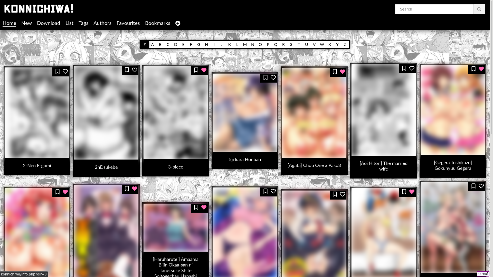
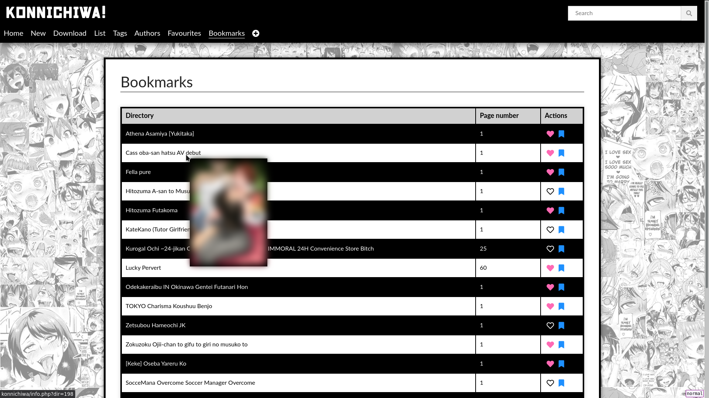
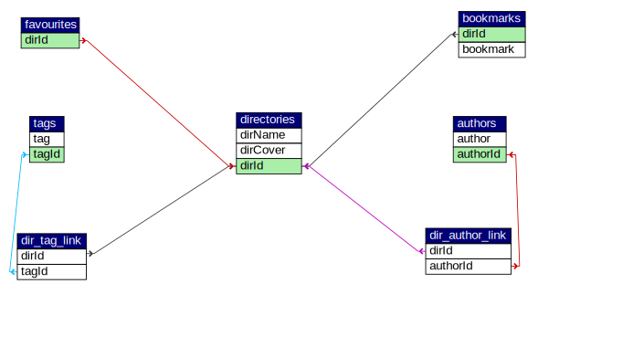

<p align="center"></p>
<h1 align="center">Konnichiwa</h1>
<p align="center">A Manga and Doujinshi manager that runs on your LAMP server</p>

## Description
This is just a personal project since I wanted to learn some PHP and MySQL. And
well what could be better than a web doujinshi manager. This setup depends
on external libraries and needs some initial administration.<br>
So be prepared to do most things manually (only) while you're setting this
up.<br>
This is good if you want to work for your degeneracy.

## Screenshots
### home
<p align="center">
  
</p>

### bookmarks
<p align="center">
  
</p>

## The Servers
You need a local web server (tested with **Apache**) with PHP (with **mysqli**)
enabled and **MySQL** server running on your **Linux** machine.<br>
You can find many guides on the internet about setting those up if you're new
to it.

**For the download tab** to work properly, you need to have php-fpm with fastcgi
enabled. You can look up how to set it up if you want to use it (you should use
it regardless of if you use konnichiwa or not). If you do decide to use php-fpm,
make sure to read the [permissions](#Permissions) section.

## MySQL Database Schema
<p align="center">
  
</p>

You can find more information in
[this](help/schema-details.pdf "help/schema-details.pdf") pdf
if you want to manually setup the tables, or you may use
[this](help/create.sql "help/create.sql") sql dump to do the
same.

To create tables from the sql dump, run the following commands in the mysql
command line:
```
mysql> CREATE DATABASE dbname;
mysql> USE dbname;
mysql> SOURCE /path/to/help/create.sql
```

## External Requirements
### simple html dom
Download from
[here](https://sourceforge.net/projects/simplehtmldom/files/)
and put the `php` file as `scripts/simple_html_dom.php`.<br>
This is needed for the downloading tab.

### jquery
I don't want my webpage to connect to a CDN everytime I open it. So download
the jquery min (**not slim**) version from
[here](https://jquery.com/download/)
and put the `js` file as `scripts/jquery.js`.

But if you don't want to download jquery and are comfortable with connecting to
a CDN, you can edit the `scripts/header.php` file. The `$head` variable
contains the line `<script src="/scripts/jquery.js"></script>` which you can
edit to refer to a CDN.

### fontawesome
As said, no CDN. Download fontawesome from
[here](https://fontawesome.com/how-to-use/on-the-web/setup/hosting-font-awesome-yourself)
and put the whole directory as `assets/fontawesome`.

Same as above, if you really want, you can just edit the `$head` variable in
`scripts/header.php`, specifically the line
`<link rel="stylesheet" href="/assets/fontawesome/css/all.css">` to refer to a
CDN.

## Missing Files (Required)
### login.php
Create a file `scripts/login.php` according to your sql setup.
The content of the file is as follows (I think the variable names are
self-explanatory):
```php
<?php
$db_hostname = "hostname";
$db_username = "user";
$db_password = "password";
$db_database = "dbname";
```

### images
So obviously you need the directory in which the doujinshi images are.
Each doujinshi should have its separate subdirectory. A subdirectory may have
its own nested subdirectory.

From here on, the directory with all the subdirectories is referred to as
**holy directory**. You **MUST** name this directory as `Doujinshi`.

Now put a symlink named `images` in the same directory as `index.php` which
links to the parent of the **holy directory**.<br>
So, for instance, if the actual **holy directory** is
`/home/user/Private/Doujinshi` then you put a symlink `images` which links to
`/home/user/Private` and **NOT** `/home/adnan/Private/Doujinshi`, which can
be done by the command (may need sudo)
```bash
cd konnichiwa
ln -s /home/user/Private images
```

### directory.php
Create a file `scripts/directory.php` as per your **holy directory** setup.<br>
The content of the file is as follows:
```php
<?php
$real_directory = "/home/user/Private/";
$directory = "/images/";
// The path to the holy directory
$image_directory = $real_directory . "Doujinshi/";
// The path to prepend to image files for html display
$relative_directory = "/images/Doujinshi/";
$dir_exists = false;

if(is_dir($real_directory)) {
	$dir_exists = true;
}
```
You just need to change the `$real_directory` variable to the path of the
**parent** directory of the **holy directory**.
In the sample above, the full path to the **holy directory** would be
`/home/user/Private/Doujinshi`
* Do **NOT** remove/add any slashes to the paths

## Adding files to database
### with the refresh_db script
You can create a `scripts/modification/data.json` file with the following
structure:
```json
{
  "directories": [
    {
      "dirName": "Directory 1",
      "dirCover": "1.png",
      "authors": [
        "author"
      ],
      "tags": [
        "tag1",
        "tag2",
        "tag3",
        "tag4",
        "tag5"
      ]
    },
    {
      "dirName": "Directory 2",
      "dirCover": "ch-1 1.jpeg",
      "authors": [
        "author1",
        "author2",
        "author3"
      ],
      "tags": [
        "tag1",
        "tag2",
        "tag3",
        "tag4"
      ]
    }
  ]
}
```
Run the `scripts/modification/refresh_db.php` file and check the output for any
errors, which you need to correct manually.

### manual
You can also add directories completely manually by going to
`[hostname]/add.php` and filling out the form for each directory. If you have
a small number of directories (i.e, you're just starting out on the hoarding),
this option makes more sense.

## Fonts
You need the following fonts installed on the system:
* [Nikkyou Sans](https://www.fontspace.com/nikkyou-sans-font-f31053)
(Used in the logo)
* [Lato](http://www.latofonts.com/lato-free-fonts/)

## Recommendations
RoverWire's [virtualhost](https://github.com/RoverWire/virtualhost) script does
a pretty good job in creating an out-of-the-box usable virtualhost.

## Permissions
Make sure your server software (apache/nginx/etc) and php-fpm (if using) have
the permissions to read/write to the **holy directory**.
For me (on apache), the following steps worked:
* First of all check if the virtualhost has permissions `Require all Granted`
  for `<Directory /var/www/[VIRTUALHOST]>`.
  This can be done by going to `/etc/apache2/sites-available` and editing
  the virtualhost's configuration file `[VIRTUALHOST].conf`. (May be
  `000-default.conf`).
  This is default behaviour if you created your virtualhost with RoverWire's
  virtualhost bash script.
  If not, add this line.

* Now add `USER` (your user in LINUX) to the group `www-data` by running:
```
sudo adduser [USER] www-data
```

* `cd` into `/etc/apache2/` and edit the file `envvars`.
  In the file, find the line that says:
```
export APACHE_RUN_USER=www-data
export APACHE_RUN_GROUP=www-data
```
  and edit it to:
```
export APACHE_RUN_USER=your-username
export APACHE_RUN_GROUP=your-username-group
```
  You can check what groups your user is in by running:
```
groups [USER]
```

For php-fpm to use the same user as your server software, you need to edit the
file `www.conf` located at `/etc/php/[VERSION]/fpm/pool.d/www.conf`. Look for
the lines
```
user = www-data
group = www-data
```
and edit those to
```
user = your-username
group = your-username-group
```

**Finally**, restart apache and php-fpm services with
```
sudo service apache2 restart
sudo service php[VERSION]-fpm restart
```

This way, the server will have permissions to read/write to the user directory.
Be careful if you're going to run some deleting/writing commands with php on
your server.

## Temporary files
If you see a directory `tmp/` in your server root directory, don't panic, it's
meant to be there. It should just contain two files:
* An image which has the cover of your last previewed doujinshi
* A plain text file that contains the information of your last/current download

It should be fine if you delete the files or even the whole directory.

## Website Features
The features are pretty much obvious if you are browsing the site. The only
thing that needs explanation I think is the download tab.<br>
If you navigate to the **Download** tab in the website, you will be asked for
an ID and an optional name.
* **ID**: The nhentai id of a doujinshi that you want to download (the numbers
after the `nhentai.net/g/` part)
* **name**: The optional prefix that you want to add to the saved files' names.
The default is blank and the images have names like `{page}.{ext}` but for
instance, if the provided name was `ch-1`, the files will be saved as
`ch-1 {page}.{ext}`.

## Warning
This setup is tested only on Ubuntu 18.04, 20.04 and the site only with firefox.
If it works for you on a different system, consider updating this warning via
a pull request.
